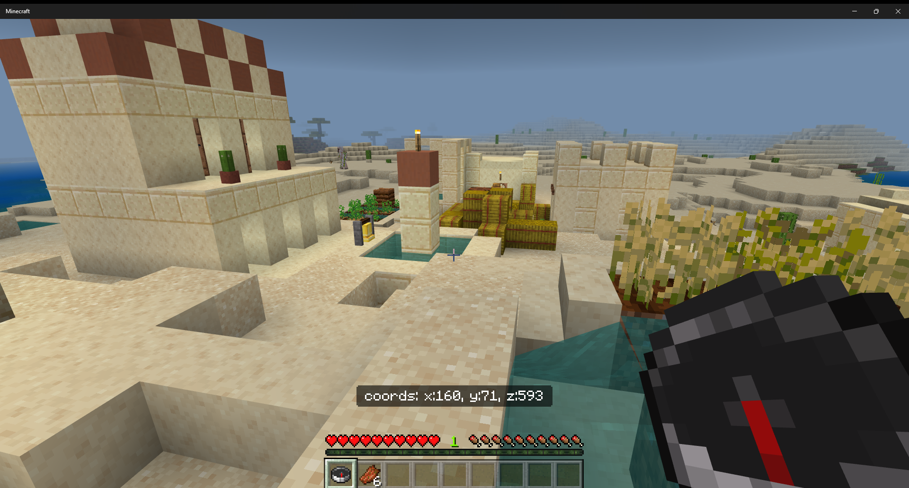

# Compass Coords

## About
Compass Coords makes compasses actually useful! By displaying coordinates when holding the compass, another level of difficulty and immersion is opened up. 
## Installation
Go the [releases page](https://github.com/fireflowerr/CompassCoords/releases/) and grab the latest release. Double click on the .mcaddon file to install. 
To use this mod, **beta apis must be enabled**.
